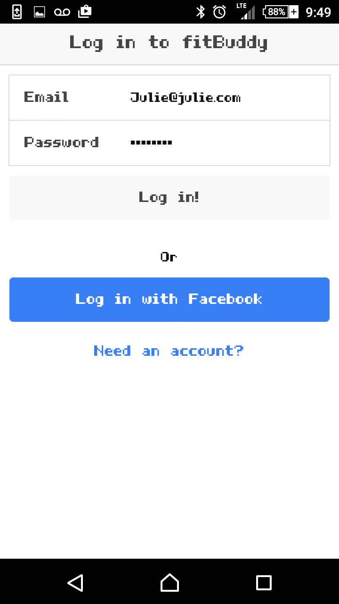
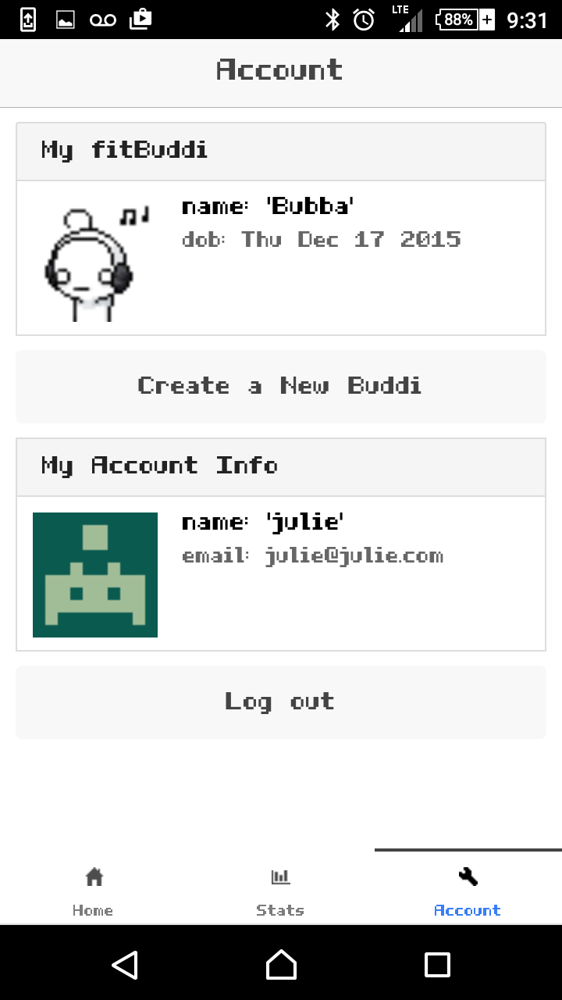
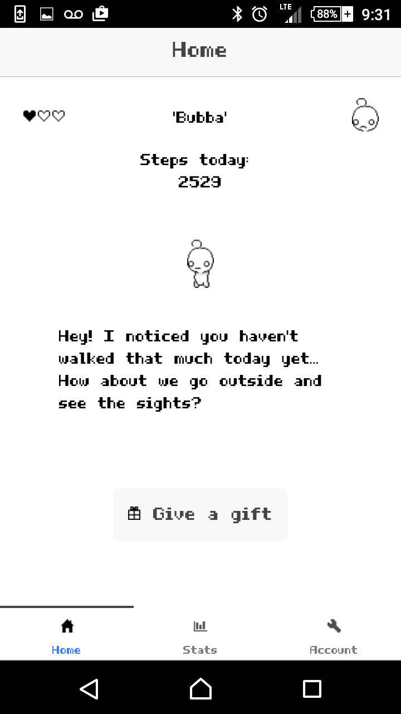
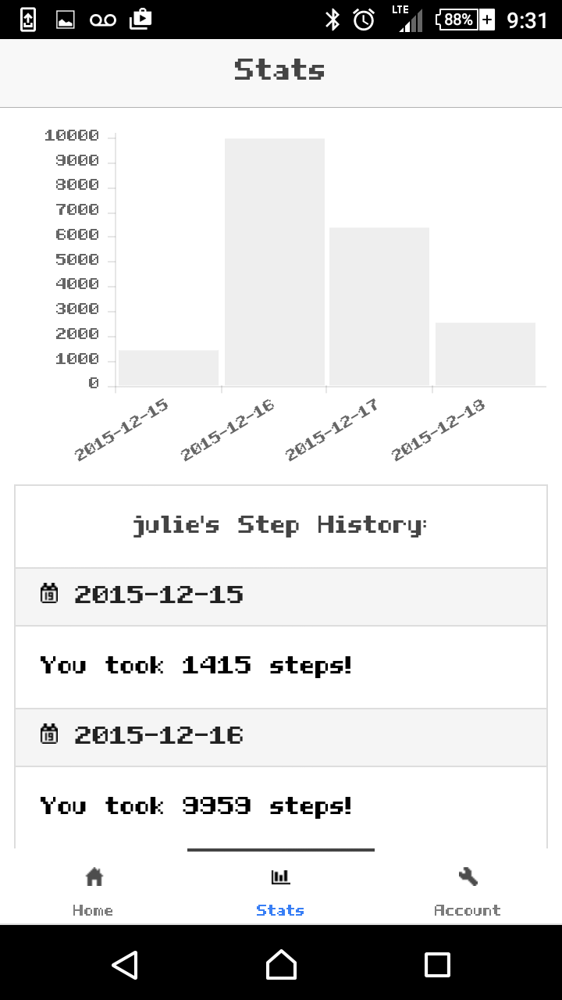

## FitBuddi
### for Android OS (Available on Google Play soon)

FitBuddi is a virtual pet that doubles as a fitness companion. Based on how many steps you take in a day, your fitBuddi's health will be high or low, giving users a visual representation of their own condition. Your fitBuddi will react and respond to you based on how active you are throughout the day, and will verbally reward you for a higher activity level.

FitBuddi was built using Ionic & Cordova using HTML5 and AngularJS and a number of other JavaScript libraries/plugins listed below. It uses Firebase and AngularFire for storing and querying data.

##### Note: This app only works with Android KitKat (4.4 or higher).

### Screenshots

### Features

* View recent step history as a log and bar graph
* View pet's health and mood
* Give a gift to your pet to improve his condition using points from your past activity (coming soon)
* Achievements (coming soon)

### Approach and Methods

[View my pitch deck folder on DropBox](https://www.dropbox.com/sh/g6hteqbf2gaou32/AAAC8tHvf9iM1iNd-HaoRhhca?dl=0)
##### The workflow I took for making this app resembled something like this:
1. Research cordova, ionic, firebase/angularfire and any required plugins to make sure the idea was feasible
2. Build out wireframes and prototype using ionic's prototype builder
3. Create my app, hook up firebase, and set up my app with facebook's dev tools for third party auth
4. Create mock account and models for user and pet
5. Generate a basic UI with tabular interface, add routing and resolve for auth
6. Hook up plugin, test on android device
7. Capture step history and graph using chartJS
8. Create spritesheet using GIMP and animating it with SpritelyJS and jQuery

### Credits

* [Ionic](https://www.ionicframework.com)
* [AngularJS](http://angularjs.org/)
* [Apache Cordova](http://cordova.apache.org/)
* [Cordova Step Counter Plugin for Android](https://github.com/texh/cordova-plugin-stepcounter)
* [jQuery](http://jquery.com)
* [jQueryUI](http://jqueryui.com)
* [SASS](http://sass-lang.com/)
* [TypedJS](http://www.mattboldt.com/demos/typed-js/)
* [SpritelyJS](http://spritely.net)
* [ChartJS](http://www.chartjs.org/)
* [Firebase](http://firebase.com)
* [AngularFire](http://www.firebase.com/docs/web/libraries/angular/)
* [This](http://po-fora.deviantart.com/art/Free-Cry-Pet-Update-1-5-469253593/) sprite resource from DeviantArt
* [GIMP](https://www.gimp.org/) (for creating sprite sheets)

### Known Issues

* Login with facebook will bring you back to the home panel, and user data will be empty
* On first open of the app, data will not load. It only loads if you switch between tabs to refresh the page.
* Buddy is not draggable in Android, but drag and drop animations are functional.

